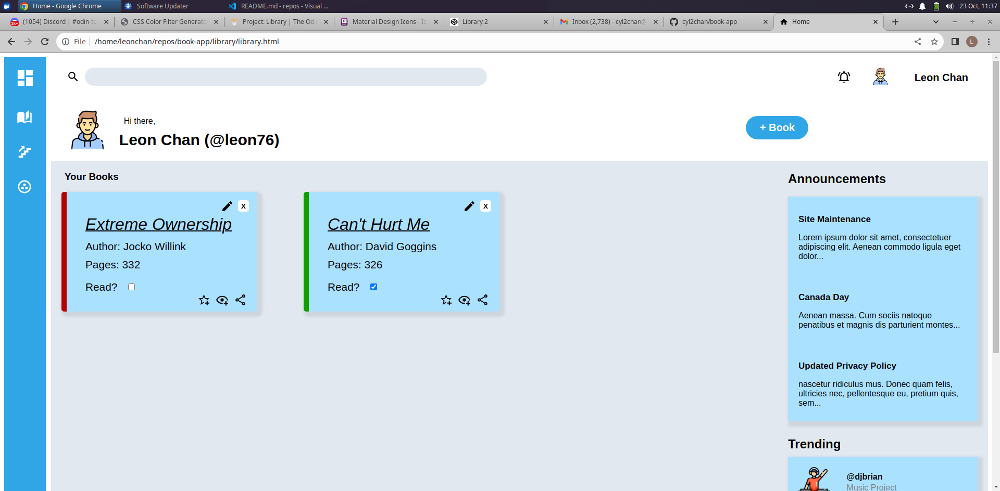
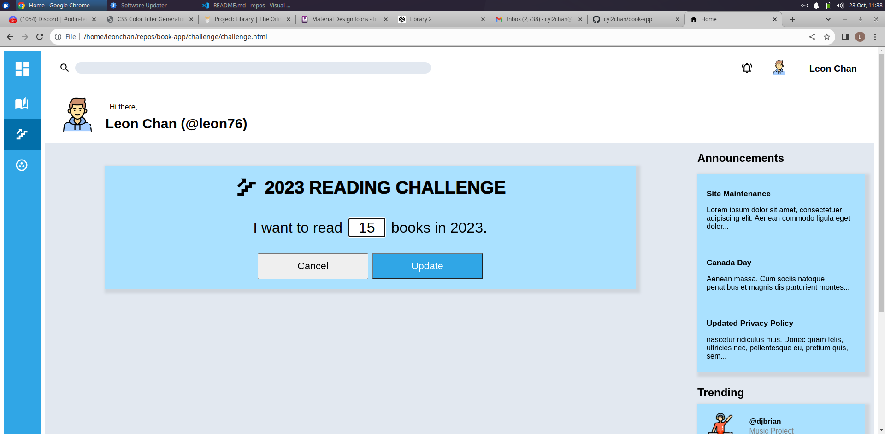
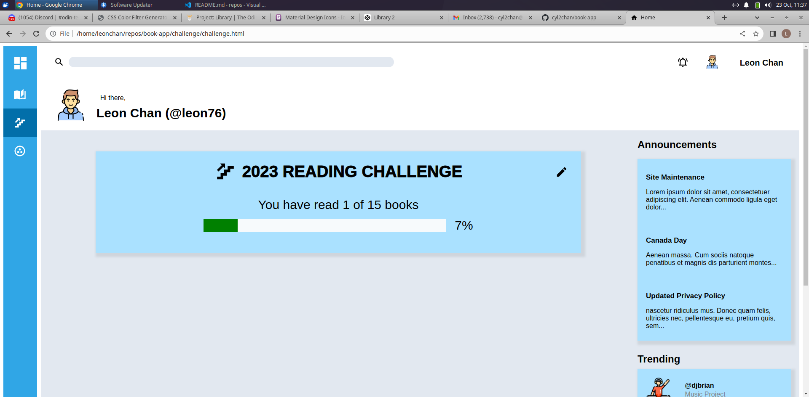

language: Javascript, CSS, HTML

In this book app, I have a Library, which stores books information, and a Reading Challenge, which you can set goals of the number of books you aim to read. 

__Local Storage__

I have used local storage to store two variables: 1) the books with checkbox ticked in the Library and 2) the goal of number of books to read. This enables me to display my progress bar in the Reading Challenge. 

Moreover, there are two default books when we first come into the Library. We can also add more books into the Library. 

I am now working on the social media aspect of this app.
 
 
__screenshots of project:__

Fig 1 below shows that there are two default books: one does not have the checkbox "Read?" ticked; another one is ticked. The latter has the left border green to indicate that it is read, while books are not yet read has the left border red. The books with their checkbox ticked are stored in local storage. 
User can click on the "+Book" blue round button on the top right hand side to add more books to the library.  
Also, user can click the "X" icon to delete a book, and click the pencil icon to edit the book information.  
fig 1: 
 

Fig 2.1 shows user can add a number in the white input box to set a goal of number of books to read. After clicking "Update" button, this number is stored local storage.  
fig 2.1: 
 

In fig 2.2, a progress bar shows your progress in your reading challenge according to the goal you have set and the number of books in the Library with the checkbox ticked. User can click the pencil icon on the top right hand side of the blue div to reset their goal. 
fig 2.2: 
 

 